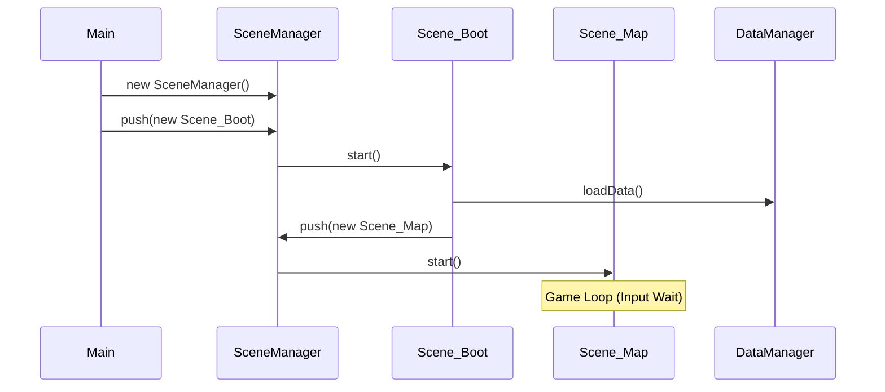
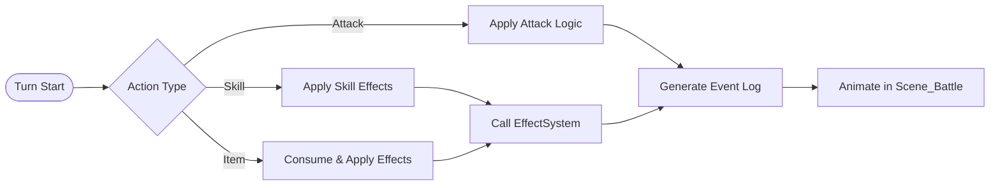

# Project Architecture & Implementation Guide

## 1. Introduction
This document details the architecture of the project. It serves as the primary reference for understanding the codebase's structural decisions, control flow, and data management. It is written to assist both human developers and AI agents in navigating and extending the system.

## 2. Core Philosophies

### 2.1. DOM-First User Interface
Unlike many HTML5 games that rely on `<canvas>` for rendering UI, this project exclusively uses the **HTML DOM** for all Interface elements (Windows, Buttons, Text).
*   **Why**: Ensures crisp text rendering, native accessibility, and simpler styling via CSS.
*   **Implementation**: `Window_Base` wraps a hierarchy of `div` elements. Animations are handled via CSS transitions or `requestAnimationFrame` manipulating style properties.
*   **Constraint**: Do not attempt to "draw" UI on the canvas. Use `document.createElement` or the `UI.build` helper.

### 2.2. Async & Event-Driven Logic
The game **does not** rely on a central "Update Loop" for game logic.
*   **Exploration**: Driven by Input Events (`keydown`, `click`). Movement and interaction happen only when triggered.
*   **Combat**: Driven by an `async/await` flow in `Scene_Battle` (via `BattleAdapter` and `BattleSystem`). The game waits for animations (`await delay()`) rather than counting frames in an `update()` method.
*   **SceneManager**: While it has an `update()` method, it is primarily for global hooks. Most Scenes (`Scene_Map`) do not implement `update()`.

### 2.3. Scene-Owned State
There is **no global singleton** for the Game Party or Map state.
*   **Pattern**: `Scene_Map` instantiates `Game_Party` and `Game_Map`.
*   **Persistence**: When transitioning to Battle or Shop, the `Scene_Map` passes the *existing instance* of `Game_Party` to the new scene.
*   **Implication**: State is preserved via object reference passing, not global variables.

### 2.4. Unified Effect System
All changes to battler state (Damage, Healing, Buffs, XP) are routed through a unified pipeline:
1.  **Source**: `Game_Action` (Skill/Item).
2.  **Logic**: `EffectSystem` (Pure Logic).
3.  **Application**: `EffectSystem.apply`.

---

## 3. Bootstrapping & Lifecycle

### 3.1. Entry Point (`src/main.js`)
The application bootstraps in `main()`:
1.  **Instantiate Managers**: `SceneManager`, `DataManager`, `WindowManager` are created as singletons.
2.  **Input Handling**: A global `keydown` listener is attached to `document`.
    *   *Priority*: `WindowManager` gets first refusal (for modals).
    *   *Delegation*: If unhandled, passes to `SceneManager.currentScene()`.
3.  **Initial Scene**: Pushes `Scene_Boot`.

### 3.2. Scene Lifecycle
Scenes inherit from `Scene_Base`.
1.  **Push**: `sceneManager.push(newScene)` pauses the current scene.
2.  **Start**: `newScene.start()` is called.
3.  **Pop**: `sceneManager.pop()` destroys the current scene and resumes the previous one.



---

## 4. System & Adapter Architecture (The Engine)
The project is transitioning to a "Hexagonal" (Ports & Adapters) architecture. Core logic resides in `src/engine/` and communicates with the UI via `src/adapters/`.

### 4.1. Core Engine (`src/engine/systems/`)
*   **BattleSystem**: Pure logic for Turn Order, AI decisions, and Round resolution.
*   **ExplorationSystem**: Logic for grid movement and collisions.
*   **InterpreterSystem**: Logic for event command execution and state management.
*   **EffectSystem** (`src/engine/rules/effects.js`): Pure registry of effect handlers.

### 4.2. Adapters (`src/adapters/`)
*   **BattleAdapter**: Connects `Scene_Battle` (UI) to `BattleSystem`.
*   **ExplorationAdapter**: Connects `Scene_Map` to `ExplorationSystem`.
*   **InterpreterAdapter**: Connects `Scene_Map` events to `InterpreterSystem` and handles UI side-effects (Show Text, Quest Offers).

### 4.3. Infrastructure Managers (`src/managers/`)
*   **SceneManager**: Stack-based State Machine.
*   **WindowManager**: Visual Stack management.
*   **DataManager**: Static asset loader.
*   **TraitManager** (*Legacy*): Removed. Parameter calculations now handled by `src/engine/rules/traits.js`.
*   **EncounterManager** (*Legacy*): Generates enemies. Active but scheduled for migration to `EncounterSystem`.

---

## 5. Game Objects

### 5.1. Game_Party (`src/objects/party.js`)
*   **Storage**: Holds the `members` array (Instances of `Game_Battler`) and `inventory`.
*   **Slots**: Fixed indices (0-3: Active, 4: Summoner, 5+: Reserve).
*   **Ownership**: Created by `Scene_Map`, passed to `Scene_Battle`.

### 5.2. Game_Battler (`src/objects/battler.js`)
*   **Composition**: Combines `actorData` (Static Template) with instance state (`hp`, `level`, `equipment`).
*   **Stats**: Calculates parameters dynamically using `TraitRules` (`src/engine/rules/traits.js`).

### 5.3. Game_Map (`src/objects/map.js`)
*   **Grid**: 2D array of tiles.
*   **State**: Tracks `visited` (Fog of War) and `events`.
*   **Role**: Pure data container; logic has moved to `ExplorationSystem`.

---

## 6. The UI System

### 6.1. Window_Base (`src/presentation/windows/base.js`)
The ancestor of all UI components.
*   **Structure**:
    ```html
    <div class="window-frame">
      <div class="window-header">...</div>
      <div class="window-content">
          <div class="window-panel">...</div>
      </div>
      <div class="window-footer">...</div>
    </div>
    ```
*   **Lifecycle**: `open()` / `close()` with CSS-based animations.

### 6.2. UI.build (`src/presentation/windows/builder.js`)
A helper utility to construct DOM trees declaratively.

```javascript
UI.build(parent, {
    type: 'panel',
    props: { className: 'my-class' },
    children: [...]
});
```

---

## 7. Combat System (Scene_Battle)

### 7.1. Round-Based Turn System
*   **System**: `BattleSystem` (`src/engine/systems/battle.js`).
*   **Logic**:
    1.  `planRound()`: Sorts participants by Total Speed (Battler `asp` + Action `speed`).
    2.  `resolveRound()`: Iterates through the sorted queue.
*   **Flow**:
    *   Pre-round: Command Input.
    *   Execution: Actions execute sequentially.

### 7.2. Action Pipeline (`src/objects/action.js`)
An action is executed in stages:
1.  **Instantiation**: `new Game_Action(subject)`.
2.  **Configuration**: `.setItem()` or `.setSkill()`.
3.  **Application**:
    *   **Exploration**: `Game_Action.apply(target)` -> Delegates to `EffectSystem`.
    *   **Battle**: `BattleSystem` builds events and calls `EffectSystem` directly (Note: Duplicate logic exists between `Game_Action` and `BattleSystem`).
4.  **Effect Resolution**: `EffectSystem.apply()` executes pure logic.
5.  **Animation**: Scene iterates `Event[]` and plays animations/logs.



---

## 8. Exploration System (Scene_Map)

### 8.1. Grid Movement
*   **System**: `ExplorationSystem` (`src/engine/systems/exploration.js`).
*   **Input**: Discrete `dx, dy` inputs.
*   **Resolution**: Returns a result object (e.g., `{ type: 'MOVED' }`, `{ type: 'BLOCKED', reason: 'wall' }`).

### 8.2. Event Execution
*   **System**: `InterpreterSystem` (`src/engine/systems/interpreter.js`).
*   **Adapter**: `InterpreterAdapter` (`src/adapters/interpreter_adapter.js`).
*   **Command Pattern**: Events are lists of commands (`TEXT`, `GIVE_ITEM`, `BATTLE`).
*   **Async**: `executeSequence` pauses map input until the event chain completes.

---

## 9. Guidelines for AI Agents

When modifying this codebase, strictly adhere to these rules:

1.  **NO Canvas Drawing**: Never try to draw UI on a canvas. Create a `Window_X` class extending `Window_Base` and use DOM elements.
2.  **Respect State Ownership**: Do not look for `window.$gameParty`. Access `this.party` within the context of the current Scene or Adapter.
3.  **Use the Action Pipeline**: Do not modify HP directly in battle logic. Create a `Game_Action` and execute it to ensure logs, animations, and side-effects (like reactions) occur.
4.  **Async/Await Over Update**: If adding a sequence (like a tutorial), write an `async` function and `await` the steps. Do not try to implement a state-machine in an `update()` loop.
5.  **Data-Driven**: Hardcode as little as possible. Define new items/skills in `data/` JSON files, and new behavior in `EffectSystem` or `TraitManager`.

---

## 10. Transitional Architecture Notes
*While the current implementation is functional, the following areas are in transition toward the ideal architecture:*

*   **Encounter Logic**: `EncounterManager` is active but will eventually move to `EncounterSystem`.
*   **Logic Separation**: The migration of Battle, Exploration, and Interpreter logic to `src/engine/` is complete. `TraitManager` has been replaced by `TraitRules`.
